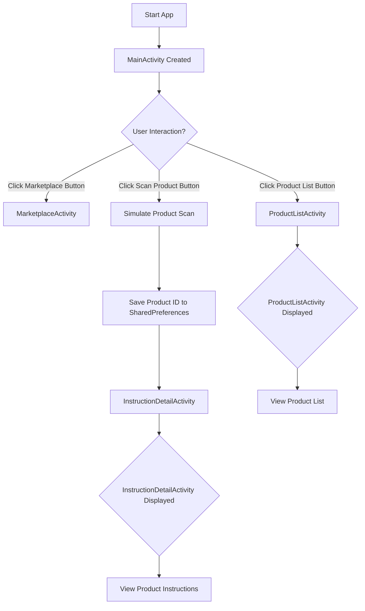

# BuildWell-App

This is the BuildWell-App, an Android application designed to help users manage products, potentially in a marketplace or building project context.

## Features

*   **Marketplace:** Explore and interact with a marketplace of products. (not implemented, would open up your default browser to open the website marketplace, or directly display the website HTML code)
*   **Product Scanning:** Simulate scanning products and save them for future reference. (due to hardware issues with my laptop webcam, developing a working qr code scanner was unsuccessfull. This silmulates scanning and returning the value of a qr code "coffee-machine")
> 

*   **Product List:** View a list of scanned or available products.
*   **Instruction Details:** Get detailed instructions for specific products.
*   **Data Persistence:** Scanned products are saved locally using SharedPreferences.

## Getting Started

### Downloading a Release from GitHub

To get a pre-built release of the BuildWell-App, follow these steps:

> **(please note that we do not take responsability in case of malware, install at your own risk)**

1.  Go to the [GitHub repository for this project](YOUR_GITHUB_REPO_URL_HERE - **Replace with your actual repo URL**).
2.  Click on the "Releases" tab.
3.  Find the latest release and download the `.apk` file.
4.  Transfer the `.apk` file to your Android device.
5.  On your Android device, enable installation from unknown sources (you may need to adjust this setting in your device's security settings).
6.  Open the downloaded `.apk` file and install the app.

### Building from Source

If you want to build the app from the source code, you will need Android Studio.

1.  Clone the repository:
```
bash git clone YOUR_GITHUB_REPO_URL_HERE
```

2.  Open the project in Android Studio.
3.  Sync the project with Gradle files.
4.  Run the app on an emulator or a physical device.

## How the Code Functions

The app is structured using standard Android components like Activities.

*   **MainActivity:** The main entry point of the app. It contains buttons to navigate to different sections: Marketplace, Scan Product, and Product List. It also handles the simulation of a product scan and saves the scanned product ID using SharedPreferences.
*   **MarketplaceActivity:** (Not fully shown in the provided code) This activity would likely handle the display and interaction with the product marketplace.
*   **InstructionDetailActivity:** (Not fully shown in the provided code) This activity receives a product ID as an Intent extra and displays instructions related to that product.
*   **ProductListActivity:** (Not fully shown in the provided code) This activity would likely retrieve the list of scanned products from SharedPreferences and display them.

Data persistence for scanned product IDs is managed using Android's `SharedPreferences`. A set of scanned product IDs is stored under the key `"scanned_products"`.

## Flowchart

Here's a flowchart illustrating the main workflow of the app:

**Explanation of the Flowchart:**

*   **Start App:** The application begins execution.
*   **MainActivity Created:** The main screen of the app is initialized and displayed.
*   **User Interaction?:** The app waits for the user to interact with the buttons on the main screen.
*   **Click Marketplace Button:** If the user taps the "Marketplace" button, they are directed to the Marketplace screen.
*   **Click Scan Product Button:** If the user taps the "Scan Product" button, the app simulates a product scan.
*   **Simulate Product Scan:** A placeholder step representing the process of obtaining a product's unique identifier.
*   **Save Product ID to SharedPreferences:** The simulated product ID is saved to the app's local storage (SharedPreferences) for future reference.
*   **Navigate to InstructionDetailActivity:** The app transitions to the screen that displays instructions for the scanned product.
*   **InstructionDetailActivity Displayed:** The instruction screen is shown to the user.
*   **View Product Instructions:** The user can read and interact with the product instructions.
*   **Click Product List Button:** If the user taps the "Product List" button, they are taken to the Product List screen.
*   **ProductListActivity Displayed:** The screen showing a list of products is displayed.
*   **View Product List:** The user can see and interact with the list of products.

